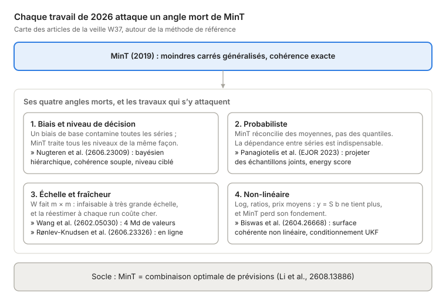

# La réconciliation hiérarchique expliquée

*Guide d'introduction pour Data Scientist stagiaire, et lecture commentée des articles de la veille W37*

2 octobre 2026

## Pourquoi ce document

Une entreprise prévoit ses ventes à plusieurs niveaux à la fois : par produit, par magasin, par région, au national. Prévus séparément, ces chiffres ne s'additionnent presque jamais. La **réconciliation hiérarchique** est l'ensemble des méthodes qui les remettent d'accord, en perdant le moins de précision possible, et si possible en en gagnant.

Ce guide a deux objectifs :

1. **Poser les bases** : le problème, les méthodes classiques, puis la méthode de référence (MinT), avec l'intuition avant les équations.
2. **Lire les articles de la veille W37** (bloc 1) : ce que chacun apporte, et où il se place par rapport aux autres.

**Prérequis** : la régression linéaire, la notion de variance et de covariance, et des notions de prévision de séries temporelles (un modèle par série, un horizon, des résidus). Il n'est pas nécessaire de connaître l'algèbre des projections : elle est expliquée en chemin.

**Fil rouge** : un exemple de ventes à 2 régions × 2 canaux (GMS et RHD), celui des notebooks du dépôt W37. Chaque idée est illustrée sur cet exemple avant d'être généralisée.

## 1. Le problème : des prévisions qui ne s'additionnent pas

Quand chaque série d'une hiérarchie est prévue par son propre modèle, les prévisions des niveaux agrégés ne sont pas égales à la somme des prévisions des niveaux fins. On dit qu'elles sont **incohérentes**.

### L'exemple fil rouge

Un industriel agroalimentaire vend dans deux régions (Bretagne, Pays de la Loire) et par deux canaux : la grande distribution (GMS) et la restauration hors domicile (RHD). Cela donne 7 séries : 1 total, 2 régions et 4 séries « région × canal ». Ces 4 dernières sont les **feuilles** (on dit aussi *bottom level*). Toutes les autres s'obtiennent en les additionnant. (Le dépôt W37 travaille sur les 6 séries régions + feuilles, sans le total.)

On entraîne un modèle par série, par exemple AutoETS, et on obtient pour le trimestre prochain (chiffres illustratifs, en tonnes) :

| Série | Prévision de base | Somme de ses enfants | Écart |
| --- | --- | --- | --- |
| Total | 1 000 | 560 + 470 = 1 030 | −30 |
| Bretagne | 560 | 330 + 245 = 575 | −15 |
| Pays de la Loire | 470 | 290 + 190 = 480 | −10 |

Aucun modèle n'a « tort » : chacun a été entraîné sur sa propre série, avec son propre bruit. Mais le directeur commercial reçoit trois chiffres différents pour la même chose.

Les deux régions et le total sont entièrement déterminés par les 4 feuilles. Leurs prévisions de base, elles, ne le sont pas.

### Pourquoi c'est un vrai problème

- **Les décisions sont prises à des niveaux différents.** La production se planifie au national, l'approvisionnement par région, les commerciaux sont pilotés par canal. Si les chiffres ne collent pas, chaque équipe défend le sien.
- **L'arbitrage manuel coûte cher.** Dans beaucoup d'entreprises, une réunion mensuelle (le « S&OP ») sert d'abord à recoller les chiffres à la main. C'est lent, et la confiance dans les prévisions s'érode.
- **L'information est gaspillée.** Le total est souvent plus facile à prévoir (le bruit des feuilles se compense), les feuilles portent des signaux locaux (une promotion, un nouveau client). Choisir un seul niveau, c'est jeter l'information des autres.

### La matrice de sommation S

Toute la théorie repose sur un objet simple. On note b le vecteur des 4 feuilles et y le vecteur des 7 séries. La hiérarchie s'écrit y = S b, où S dit quelles feuilles composent chaque série :

$$
\begin{pmatrix} y_{\text{Total}} \\ y_{\text{Bretagne}} \\ y_{\text{PdL}} \\ y_{\text{B/GMS}} \\ y_{\text{B/RHD}} \\ y_{\text{P/GMS}} \\ y_{\text{P/RHD}} \end{pmatrix}
=
\underbrace{\begin{pmatrix} 1 & 1 & 1 & 1 \\ 1 & 1 & 0 & 0 \\ 0 & 0 & 1 & 1 \\ 1 & 0 & 0 & 0 \\ 0 & 1 & 0 & 0 \\ 0 & 0 & 1 & 0 \\ 0 & 0 & 0 & 1 \end{pmatrix}}_{S}
\begin{pmatrix} b_{\text{B/GMS}} \\ b_{\text{B/RHD}} \\ b_{\text{P/GMS}} \\ b_{\text{P/RHD}} \end{pmatrix}
$$

Un vecteur de prévisions est **cohérent** s'il peut s'écrire S b pour un certain b. Les vraies valeurs le sont toujours. Les prévisions de base, notées ŷ, presque jamais.

Le vocabulaire à retenir : m = nombre total de séries (ici 7), n_b = nombre de feuilles (ici 4). On parle de **hiérarchie** quand il y a un seul chemin d'agrégation (un arbre), et de **séries groupées** quand plusieurs découpages se croisent, par exemple par région *et* par canal, avec un sous-total « GMS national ». La matrice S couvre les deux cas.

## 2. Les approches classiques : choisir un niveau et en déduire les autres

Les premières méthodes rendent les prévisions cohérentes en ne faisant confiance qu'à **un seul niveau**, puis en déduisant tous les autres. Elles sont simples et encore très utilisées, mais elles jettent de l'information.

| Méthode | Principe | Points forts | Limites |
| --- | --- | --- | --- |
| **Bottom-up** | On prévoit les feuilles, puis on additionne. | Aucune perte d'information locale (promotions, nouveaux clients). Cohérent par construction. | Les feuilles sont bruitées : le total hérite de la somme des erreurs. Les séries fines sont souvent intermittentes (beaucoup de zéros). |
| **Top-down** | On prévoit le total, puis on le répartit selon des proportions (parts historiques, ou parts prévues). | Le total est la série la plus lisse, donc la mieux prévue. | Les proportions historiques ignorent les dynamiques locales. Avec des parts historiques, la méthode est biaisée dès que la composition change. |
| **Middle-out** | On prévoit un niveau intermédiaire (ici la région), on agrège vers le haut et on répartit vers le bas. | Un compromis qui peut coller à l'organisation (le niveau où l'on décide). | Combine les défauts des deux, et le choix du niveau est arbitraire. |

Sur l'exemple : en bottom-up, le total devient 330 + 245 + 290 + 190 = 1 055, et la prévision de base du total (1 000) est simplement ignorée. En top-down, on garde 1 000 et on le répartit, par exemple au prorata des ventes de l'an dernier. Le signal local « la RHD bretonne décolle » est perdu.

**Le point commun** : chaque méthode fait comme si un seul niveau disait vrai. Or chaque niveau contient une partie de l'information. L'idée moderne est de **combiner toutes les prévisions de base**, en pondérant chacune selon sa fiabilité.

> **Point d'attention.** Le top-down par proportions historiques est un piège classique en production. Si les proportions sont calculées sur une période qui inclut la période évaluée, l'évaluation est faussée par une fuite de données. Les proportions doivent toujours venir d'une fenêtre strictement antérieure à l'origine de la prévision.

## 3. La réconciliation optimale : MinT

La méthode de référence depuis 2019 s'appelle **MinT** (*Minimum Trace*, Wickramasuriya, Athanasopoulos et Hyndman). Elle prend toutes les prévisions de base, les combine en tenant compte de leur fiabilité, et renvoie des prévisions cohérentes dont l'erreur totale est la plus petite possible.

### L'idée en une phrase : réconcilier, c'est projeter

Toute réconciliation linéaire s'écrit en deux temps :

1. à partir des m prévisions de base ŷ, on **estime les feuilles** : b̃ = G ŷ, où G est une matrice n_b × m ;
2. on **réagrège** : ỹ = S b̃ = S G ŷ.

Le résultat est cohérent par construction. Toutes les méthodes ne diffèrent que par le choix de G. Le bottom-up, par exemple, est le G qui garde les feuilles et ignore le reste.

**Intuition géométrique.** Les vecteurs cohérents forment un sous-espace de dimension n_b dans l'espace ℝ^m des prévisions (un « plan » dans un espace plus grand). Les prévisions de base tombent à côté de ce plan. Réconcilier, c'est ramener le point sur le plan : c'est une **projection**, notée P = S G.

### La condition de non-biais

On veut que la réconciliation ne déforme pas des prévisions qui seraient déjà justes. Si ŷ est déjà cohérent, la projection doit le laisser tel quel. Cela s'écrit :

$$S\,G\,S = S$$

Sous cette condition, des prévisions de base **sans biais** donnent des prévisions réconciliées **sans biais**.

### Choisir la meilleure projection

Il existe une infinité de G qui vérifient S G S = S. Pour choisir, on regarde l'erreur des prévisions réconciliées. Si W désigne la matrice de covariance des erreurs de base (m × m), celle des erreurs réconciliées vaut S G W G′ S′. MinT choisit le G qui minimise la **trace** de cette matrice, c'est-à-dire la somme des variances d'erreur de toutes les séries. La solution a une forme fermée :

$$G = (S' W^{-1} S)^{-1} S' W^{-1}$$

C'est exactement la formule des **moindres carrés généralisés** d'une régression de ŷ sur S : on « régresse » les prévisions de base sur la structure de la hiérarchie.

La projection est **oblique** : elle fait plus confiance aux séries dont l'erreur est faible (W⁻¹ grand) et corrige davantage celles qui sont bruitées.

### Toute une famille de méthodes, selon W

W est inconnue : il faut l'estimer, en général à partir des résidus in-sample des modèles de base. Chaque façon de l'estimer donne une méthode.

| Méthode | Choix de W | Quand l'utiliser |
| --- | --- | --- |
| **OLS** | W = I (toutes les erreurs ont la même taille, sans corrélation) | Aucune information sur les erreurs. Projection orthogonale. |
| **WLS structurelle** | W diagonale, proportionnelle au nombre de feuilles de chaque série | Pas de résidus fiables, mais on sait que les agrégats cumulent plus de volume. |
| **WLS variance** | W diagonale, variances des résidus | On connaît la précision de chaque série, mais pas les corrélations. |
| **MinT sample** | W = covariance empirique complète des résidus | Beaucoup d'historique, peu de séries. |
| **MinT shrink** | Covariance empirique « rétrécie » vers sa diagonale | Le choix par défaut en pratique. |

### Pourquoi le shrinkage est indispensable

La covariance empirique d'une matrice de résidus T × m est de rang au plus T. Avec plus de séries que de dates d'historique (m > T), elle n'est **pas inversible**, et la formule de G ne peut pas être calculée. C'est le cas courant : 40 000 SKU et 3 ans d'historique hebdomadaire donnent m/T ≈ 250.

Le **shrinkage** (estimateur de Schäfer et Strimmer, 2005) mélange la covariance empirique avec sa diagonale :

$$W = \lambda\,\mathrm{diag}(W_1) + (1-\lambda)\,W_1$$

Le poids λ est estimé à partir des données : il est proche de 1 quand les corrélations observées ressemblent à du bruit, et proche de 0 quand elles sont solides. Dans le bloc 2 du dépôt, le shrinkage fait passer le conditionnement de W d'environ 30 000 à environ 23, ce qui rend l'inversion stable.

> **À retenir.** MinT = moindres carrés généralisés des prévisions de base sur la structure S. Le choix de W fait toute la méthode. En pratique, on utilise **mint_shrink**, et l'on documente l'estimateur exact : centrage, normalisation, version de la bibliothèque. Ces détails changent le chiffre publié.

## 4. Ce que MinT ne garantit pas

MinT est optimal sous des hypothèses précises. Trois d'entre elles tombent souvent en pratique, et ce sont justement les fronts sur lesquels travaillent les articles de la veille. Les chiffres ci-dessous viennent des expériences du [bloc 4](../04_fondamentaux/README.md) du dépôt.

### Limite 1 : MinT préserve l'absence de biais, il ne la crée pas

Si une seule prévision de base est biaisée, MinT répartit ce biais sur toutes les séries. Exemple : un total biaisé de +15, des feuilles parfaites, et une W qui fait 9 fois plus confiance au total qu'à chaque feuille. Après MinT, le total garde un biais de 14,5, et **chaque feuille reçoit +4,8** alors qu'aucune n'était fausse. Le bottom-up, lui, n'aurait rien vu.

Au-delà d'un certain seuil de biais, MinT fait pire que le bottom-up à tous les niveaux. Le réflexe est donc de tester la moyenne des résidus de chaque série, et de corriger le biais **avant** de réconcilier.

### Limite 2 : cohérent ne veut pas dire calibré

MinT réconcilie des **moyennes**. Or les décisions s'appuient souvent sur des **quantiles** : un stock de sécurité visé à 90 % de taux de service, un intervalle de prévision. Or le quantile d'une somme n'est pas la somme des quantiles.

Trois façons de faire ont été comparées pour un quantile à 90 % (1 total, 3 régions corrélées) :

| Méthode | Ce qu'elle fait | Couverture réelle au total (cible 0,90) |
| --- | --- | --- |
| A | appliquer P à un vecteur de quantiles | 0,922 (et environ 0,89 ailleurs) |
| B | tirer des échantillons **indépendants** par série, les projeter, lire les quantiles | **0,764** |
| C | tirer des échantillons **joints** (qui respectent la dépendance entre séries), les projeter | 0,900 |

La méthode B semble rigoureuse, et c'est la pire : l'intervalle annoncé à 90 % couvre en réalité 76 % des cas au total. Réconcilier une distribution exige de connaître la **dépendance** entre séries. En pratique, on l'obtient par un bootstrap qui tire les résidus de toutes les séries **au même instant**.

### Limite 3 : l'échelle

W est une matrice m × m. À 40 000 séries, elle occupe déjà 12,8 Go en mémoire, et l'inverser devient le goulot d'étranglement. Le dépôt s'est d'ailleurs heurté à ce mur : une implémentation naïve du calcul de λ demandait 31 Go pour 5 000 séries. Il faut alors exploiter la structure du problème plutôt que la force brute.

### Et une hypothèse cachée : la linéarité

Toute la théorie suppose que les séries s'additionnent : y = S b. C'est vrai pour des volumes. C'est faux dès qu'on modélise des logarithmes, des ratios ou des prix moyens : le prix moyen national n'est pas la somme des prix moyens régionaux. MinT n'est alors plus fondé.

> **À retenir.** MinT vend de la **cohérence**, pas de la précision garantie. Ses quatre angles morts sont le biais, le probabiliste, l'échelle et le non-linéaire. La section suivante montre que chaque article de la veille s'attaque à l'un d'eux.

## 5. Les articles de la veille W37, un par un

La veille retient quatre articles de 2026 et deux lectures d'appui. Chacun répond à l'une des limites de la section précédente, ou change la façon de regarder MinT.

> **Point d'attention sur les sources.** Ces résumés s'appuient sur les **pages de résumé (abstracts)** vérifiées lors du bloc 1, pas sur la lecture intégrale des articles. Ce qui va au-delà du résumé est signalé comme non vérifié. Avant de citer un résultat précis, lisez l'article lui-même.

### Article 1 : la réconciliation est une combinaison de prévisions

[A Forecast Combination Framework for Hierarchical and Grouped Time Series Reconciliation](https://arxiv.org/abs/2608.13886), Xixi Li, Zijia Chen, James W. Taylor, Xiaojie Mao. arXiv 2608.13886, août 2026.

**Le contexte.** La *combinaison de prévisions* est un vieux résultat de la prévision : la moyenne pondérée de plusieurs prévisions bat souvent la meilleure d'entre elles. Il existe 50 ans de techniques pour choisir les poids : shrinkage, poids positifs, pénalités.

**L'idée.** Pour chaque feuille, la hiérarchie fournit plusieurs prévisions « candidates ». Dans l'exemple, la feuille Bretagne/GMS peut être prévue directement, ou bien comme « prévision de Bretagne moins prévision de Bretagne/RHD ». Les auteurs construisent des candidates linéairement indépendantes et montrent que **les poids de combinaison optimaux (au sens de l'erreur quadratique moyenne) redonnent exactement MinT**.

**Ce que ça change.** MinT n'est plus une formule à part : c'est une combinaison optimale. Toute la boîte à outils de la combinaison devient donc utilisable pour la réconciliation. Les auteurs proposent un cadre pénalisé modulaire, avec shrinkage de la covariance, pénalisation des poids et estimation série par série.

**Pour vous.** C'est un excellent article pour *comprendre* MinT. Si vous savez ce qu'est une moyenne pondérée optimale, vous savez déjà ce que fait MinT.

### Article 2 : la réconciliation en ligne

[Online forecast reconciliation using linear models](https://arxiv.org/abs/2606.23326), Tobias Rønlev-Knudsen, Henrik Madsen, Jan Kloppenborg Møller. arXiv 2606.23326, juin 2026.

**Le problème.** En production, on réestime en général W et G à chaque run, sur tout l'historique. C'est coûteux, et cela réagit lentement quand le comportement des séries change.

**L'idée.** Les auteurs écrivent la réconciliation comme une **régression linéaire**, puis en dérivent un schéma d'estimation **récursif**, inspiré des moindres carrés récursifs. Le modèle se met à jour à chaque nouvelle observation, sans tout recalculer. Ils explicitent aussi les liens entre régression ridge, estimation bayésienne et shrinkage : ce sont trois façons de dire « ne fais pas trop confiance aux données quand elles sont rares ». L'implémentation est dans le package `PyOnlineForecast`.

**Le cas d'étude.** La charge d'un réseau de chaleur, avec une **hiérarchie temporelle**. Ici, ce ne sont pas des régions qui s'additionnent : ce sont les pas de temps (les heures d'une journée donnent la journée).

**Nuance.** Le résumé parle de hiérarchie temporelle, pas géographique. Le transposer tel quel à une hiérarchie région × canal demande une vérification.

### Article 3 : viser le niveau qui porte la décision

[Hierarchical Bayes meets hierarchical forecasting: A flexible framework for level-focused forecasts](https://arxiv.org/abs/2606.23009), Arwen Nugteren, Mahdi Abolghasemi, Kerrie Mengersen, Christopher Drovandi. arXiv 2606.23009, juin 2026.

**Le problème.** MinT minimise une erreur totale qui traite tous les niveaux de la même façon. Or l'entreprise décide souvent à un niveau précis : si l'approvisionnement se fait par produit, gagner au national en perdant au produit est une régression.

**L'idée.** Un **modèle bayésien hiérarchique** partage l'information entre niveaux *pendant* l'estimation, au lieu de réconcilier après coup. Il peut **pénaliser l'incohérence de façon souple**, et concentrer l'effort du modèle sur les niveaux qui comptent pour la décision.

**Nuances.** La cohérence y est *souple* : les prévisions sont poussées vers la cohérence, sans garantie que la somme tombe juste. Si un contrat exige des chiffres qui s'additionnent exactement, il faut une projection finale. Par ailleurs, la notation « λᵢ par niveau » du plan W37 ne figure pas dans le résumé (non vérifié).

**Lien avec le dépôt.** Le bloc 4 montre que, sans biais et avec la vraie W, MinT est déjà optimal à tous les niveaux à la fois : pondérer les niveaux n'y change rien. La pondération devient utile précisément quand on relâche une hypothèse, comme la cohérence exacte dans cet article.

### Article 4 : la réconciliation à l'échelle du milliard

[Billions-Scale Forecast Reconciliation](https://arxiv.org/abs/2602.05030), Tianyu Wang, Matthew C. Johnson, Steven Klee, Matthew L. Malloy. arXiv 2602.05030, février 2026.

**Le problème.** Un distributeur avec des produits × entrepôts × enseignes peut avoir des milliards de valeurs à réconcilier. Impossible de former, et encore moins d'inverser, une matrice W de cette taille.

**L'idée.** Poser la réconciliation comme un **problème d'optimisation sous contraintes d'additivité**, résolu efficacement au-delà de quatre milliards de valeurs prévues. Résultat théorique clé : pour une classe restreinte de problèmes, et avec une perte convenablement pondérée, la réconciliation par **moindres carrés** est équivalente à une réconciliation **par parts** (*share-based*, proche du top-down par proportions). Le résultat est étendu aux hiérarchies chevauchantes, où un même produit appartient à plusieurs agrégats.

**Pour vous.** C'est la réponse à l'objection « c'est trop lourd pour nos volumes ». L'équivalence avec la répartition par parts est aussi un bon argument pédagogique face à des métiers habitués au prorata.

### Lecture d'appui 1 : la réconciliation probabiliste

[Probabilistic forecast reconciliation: properties, evaluation and score optimisation](https://robjhyndman.com/publications/coherentprob/), Anastasios Panagiotelis, Puwasala Gamakumara, George Athanasopoulos, Rob J. Hyndman. *European Journal of Operational Research* 306(2), 2023.

C'est la référence théorique de la limite 2. L'article définit ce que veut dire réconcilier une **distribution** de prévision, et non plus un point : on projette des échantillons de la loi jointe. Il optimise les poids directement sur des scores probabilistes (**energy score**, **variogram score**), par descente de gradient stochastique. Il montre aussi que le *log score* ne convient pas pour comparer des prévisions réconciliées et non réconciliées.

### Lecture d'appui 2 : quand la contrainte n'est plus linéaire

[Nonlinear Probabilistic Forecast Reconciliation](https://arxiv.org/abs/2604.26668), Anubhab Biswas, Lorenzo Zambon, Lorenzo Nespoli, Giorgio Corani. arXiv 2604.26668, avril 2026.

C'est la réponse à l'hypothèse cachée de linéarité. Deux approches sont proposées : projeter les échantillons sur une **surface cohérente non linéaire**, ou conditionner la loi jointe grâce à un algorithme fondé sur le **filtre de Kalman « unscented »** (UKF). Selon le résumé, la seconde est meilleure et plus rapide. Les auteurs sont l'équipe IDSIA/SUPSI qui développe `bayesRecon` et BayesReconPy.

## 6. Mise en perspective : ce qui bouge dans le domaine

Les travaux de 2026 ne remplacent pas MinT : ils le **refondent** comme un estimateur statistique ordinaire, puis s'attaquent chacun à l'un de ses angles morts.

Trois tendances se dégagent de cette carte.

1. **De la formule à l'estimateur.** En 2019, MinT était une formule de projection. En 2026, c'est une combinaison optimale (article 1) ou une régression régularisée (article 2). Conséquence pratique : on peut la régulariser, la tester et la défendre avec les outils classiques de la statistique, plutôt que de dire « on répartit au prorata ».
2. **Les objections d'ingénierie tombent.** « Trop lourd pour nos volumes » : quatre milliards de valeurs (article 4). « Il faut tout recalculer chaque nuit » : estimation récursive (article 2).
3. **Le front ouvert est le probabiliste et le non-linéaire.** Être cohérent en moyenne ne suffit pas quand la décision porte sur un quantile (EJOR 2023). Et la contrainte cesse d'être linéaire dès qu'on travaille sur des prix ou des ratios (2604.26668). C'est là que la recherche est la plus active.

> **Point d'attention.** Le discours commercial « la réconciliation améliore la précision à tous les niveaux » est faux tel quel. Le gain de précision est fréquent, mais jamais garanti. Ce que la réconciliation apporte à coup sûr, c'est la **cohérence** : la fin des arbitrages manuels entre services. C'est cet argument qu'il faut mettre en avant.

## 7. À retenir

1. **Le problème** : des prévisions faites série par série ne s'additionnent pas. La hiérarchie s'écrit y = S b.
2. **Les méthodes classiques** (bottom-up, top-down, middle-out) font confiance à un seul niveau et jettent l'information des autres.
3. **MinT** combine toutes les prévisions de base par moindres carrés généralisés : G = (S′W⁻¹S)⁻¹S′W⁻¹. En pratique, W est estimée avec shrinkage.
4. **MinT vend de la cohérence**, pas une précision garantie. Il propage les biais, ne réconcilie pas des quantiles, coûte cher à grande échelle, et suppose des contraintes linéaires.
5. **La recherche 2026** attaque chacun de ces angles morts, et redéfinit MinT comme un estimateur statistique ordinaire.

### Glossaire

| Terme | Définition |
| --- | --- |
| Feuille (*bottom level*) | Série du niveau le plus fin, dont toutes les autres sont des sommes. |
| Matrice S | Matrice m × n_b qui dit quelles feuilles composent chaque série. |
| Prévision de base | Prévision produite par le modèle d'une série, indépendamment des autres. |
| Cohérent | Qui respecte les sommes de la hiérarchie : le vecteur s'écrit S b. |
| Projection P = S G | Opération qui ramène des prévisions incohérentes sur l'espace cohérent. |
| W | Covariance des erreurs de prévision de base, estimée sur les résidus in-sample. |
| Shrinkage | Mélange d'une covariance empirique avec une cible simple (sa diagonale) pour la stabiliser. |
| Hiérarchie temporelle | Hiérarchie où ce sont les pas de temps qui s'additionnent (heures → jour → semaine). |
| Séries groupées | Plusieurs découpages croisés (région et canal) au lieu d'un seul arbre. |
| Couverture | Part des cas où la vraie valeur tombe sous le quantile annoncé. Un quantile 90 % bien calibré a une couverture de 0,90. |
| Energy score | Score qui évalue une prévision probabiliste multivariée en entier, dépendance comprise. |

### Pour aller plus loin

- Le chapitre « Forecasting hierarchical and grouped time series » du livre libre [Forecasting: Principles and Practice](https://otexts.com/fpp3/hierarchical.html) de Hyndman et Athanasopoulos : la meilleure introduction, avec des exemples en R.
- [HierarchicalForecast](https://pypi.org/project/hierarchicalforecast/) (Nixtla) : l'implémentation Python de référence de BottomUp, TopDown, MinTrace et des méthodes probabilistes. Version 1.5.3 au 24/09/2026.
- [awesome-forecast-reconciliation](https://github.com/danigiro/awesome-forecast-reconciliation) : bibliographie vivante, environ 130 articles, packages R et Python.
- Le dépôt W37 : le [bloc 2](../02_mint_from_scratch/README.md) réimplémente MinT(shrink) en NumPy et le compare à HierarchicalForecast, et le [bloc 4](../04_fondamentaux/README.md) démontre les limites de la section 4.

### Sources

Articles vérifiés sur leur page de résumé le 02/10/2026 (bloc 1 de la veille W37, voir [README.md](README.md)) : [arXiv 2608.13886](https://arxiv.org/abs/2608.13886) · [arXiv 2606.23326](https://arxiv.org/abs/2606.23326) · [arXiv 2606.23009](https://arxiv.org/abs/2606.23009) · [arXiv 2602.05030](https://arxiv.org/abs/2602.05030) · [EJOR 2023, page de R. Hyndman](https://robjhyndman.com/publications/coherentprob/) · [arXiv 2604.26668](https://arxiv.org/abs/2604.26668). Les chiffres des sections 3 et 4 viennent des expériences des blocs 2 et 4 du dépôt W37.
