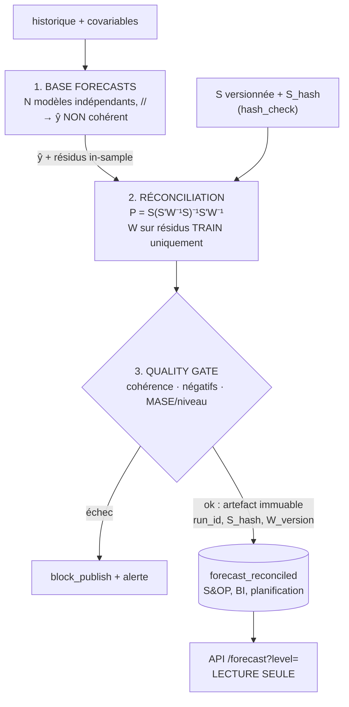

# Bloc 3 — System Design & MLOps : où vit la réconciliation ?

> La question : la réconciliation est-elle un **job batch matérialisé**, une **étape à la volée dans l'API**, une
> **vue SQL**, ou un **estimateur récursif en ligne** ? Le choix détermine ce qu'on peut garantir **contractuellement**.

## Ce qui a été fait

1. **Décision d'architecture** rédigée, avec les trade-offs et des critères de bascule écrits à l'avance (ci-dessous).
2. **Contrat** [`reconciliation.yaml`](reconciliation.yaml) v3 repris du plan, plus quelques ajouts marqués `# [ajout]`.
   Ces ajouts rendent exécutables des règles que le plan ne donnait qu'en commentaire.
3. **Briques exécutables** dans [`reconciliation_job.py`](reconciliation_job.py) :
   - `hash_check` : refuse le run si `S` a changé sans bump de version de la source ;
   - `choose_method` : garde `mint_shrink`, ou bascule sur `wls_struct` si `W` est inutilisable ;
   - `quality_gate` : contrôle la cohérence, la part de négatifs et le MASE **par niveau** contre le bottom-up.
4. **Tests** ([`test_reconciliation_job.py`](test_reconciliation_job.py)) : **11 tests verts**. Chaque règle du
   contrat a au moins un test où elle **échoue**, sinon on ne sait pas si elle protège quelque chose.
5. **Run de bout en bout** ([`demo_job.py`](demo_job.py)) sur la hiérarchie du bloc 2. Il produit un artefact
   immuable partitionné par `run_id`, avec sa lignée dans `_lineage.json`. Log : [`outputs/demo_run.log`](outputs/demo_run.log).

```bash
.venv/bin/pytest -q 03_system_design
cd 03_system_design && ../.venv/bin/python demo_job.py
```

## Architecture retenue



**Le point non négociable : l'API ne réconcilie jamais à la volée.** Sinon deux appels au même instant, sur deux
niveaux différents, peuvent renvoyer des chiffres qui ne somment pas. C'est exactement le problème que le client paie
pour supprimer. **La cohérence est une propriété de l'artefact, pas de la requête.**

## Trade-offs

| Option | Pour | Contre | |
|---|---|---|---|
| **A. Batch matérialisé** | Cohérence garantie par construction ; auditable ; un seul `run_id` à citer en comité S&OP | Latence de rafraîchissement ; recalcul complet si la hiérarchie change | ✅ **retenu** |
| **B. À la volée dans l'API** | Toujours à jour ; pas de stockage redondant | **Cohérence non garantie entre appels** ; coût CPU par requête ; impossible à auditer a posteriori | ❌ |
| **C. Vue SQL dans l'entrepôt** | Zéro infra ; le client possède le code | MinT en SQL devient ingérable dès que `W` n'est pas diagonale : on retombe en pratique sur du bottom-up déguisé | ❌ |
| **D. Estimation récursive en ligne** ([arXiv 2606.23326](https://arxiv.org/abs/2606.23326)) | `W` mise à jour à chaque observation, sans réestimation complète ; s'adapte vite aux changements de régime | État mutable à versionner et à rejouer ; déboguer un chiffre publié il y a trois semaines devient de l'archéologie | ⏳ *pas encore* |

**Décision : A, batch matérialisé avec un quality gate bloquant.**

**Critères de bascule, écrits à l'avance :**
- **vers B** si le cahier des charges exige un rafraîchissement < 15 min **et** que la hiérarchie compte moins de
  ~10 000 séries (au-delà, le coût d'inversion par requête n'est plus défendable) ;
- **vers D** si la structure de covariance dérive vite (parc énergétique, promotions hebdomadaires), **et seulement
  une fois** l'état récursif snapshotté à chaque run. Sans ça, aucune reproductibilité.
  Point vérifié au bloc 1 : le cas d'étude de 2606.23326 porte sur une hiérarchie **temporelle**. Il faut donc
  valider D sur une hiérarchie transversale avant de basculer.

## Ce que l'implémentation a appris sur le contrat

| Constat | Conséquence dans le YAML / le code |
|---|---|
| `fallback: wls_struct  # si … (m > T)` : le plan déclenche le repli quand m > T. Or le bloc 2 montre que le shrinkage **existe précisément pour m > T** (cond 1,7e17 → 10). | `residuals_fewer_than_series: false`. Le repli se déclenche sur un critère **mesuré**, `cond(W_shrink) > 1e10`, et non sur la forme. Le test `test_choose_method_keeps_mint_shrink_when_m_exceeds_T` (m = 50, T = 30) le fige. |
| Avec `covariance_window: 104` semaines et un catalogue de 4 000 séries, on a toujours m ≫ T. | Le repli ne doit **pas** dépendre de m/T, sinon `mint_shrink` ne tournerait jamais en production. |
| `coherence_tol_abs: 1e-6` n'a pas le même sens sur 10 MW et sur 50 GW (bruit flottant ≈ 1e-16 × valeur). | Ajout de `coherence_tol_rel: 1e-9` : le gate passe si l'un **ou** l'autre seuil est respecté (`test_gate_tolerates_float_noise_on_large_values`). |
| « Dégradation MASE > 2 % à **un** niveau quelconque » | Règle appliquée niveau par niveau, jamais en moyenne. Le scénario du bloc 4 (national −30 %, feuilles +5 %) est **bloqué** (`test_gate_blocks_mase_degradation_at_any_level`). |
| `level_weights` est rangé sous `quality_gate`, mais une pondération par niveau agit sur l'**objectif** de la réconciliation (bloc 4, 2606.23009), pas sur un contrôle. | Dans le gate, il ne sert qu'à **rapporter** un `weighted_mase_delta`. La règle bloquante reste « aucun niveau ne se dégrade ». |
| Un NaN dans une feuille casse silencieusement la cohérence (bloc 5). | Le gate bloque aussi les valeurs non finies (`test_gate_blocks_nan`). |
| « Hash de S » : une feuille **renommée** change la hiérarchie sans changer la matrice. | Le hash couvre les valeurs **et** les libellés (`test_hash_check_refuses_changed_structure_without_bump`). |
| Pour rejouer un chiffre publié, `run_id` ne suffit pas. | Ajout de `outputs.lineage` : `s_hash`, `w_version` (fenêtre + date de fin), méthode effectivement utilisée et raison, versions des bibliothèques. |

## Résultat du run de démonstration

`mint_shrink` est retenu (T = 72, m = 6, cond(W) = 22). Gate **vert**, artefact publié :

| Niveau | MASE MinT(shrink) | MASE bottom-up | Δ |
|---|---|---|---|
| Région | 1,1373 | 1,1368 | +0,05 % |
| Feuille (région × canal) | 1,1718 | 1,1794 | −0,64 % |

Sur cette hiérarchie synthétique, MinT ne change presque rien. Il ne dégrade aucun niveau au-delà de la tolérance de
2 %, donc la publication est autorisée. Ce sont les deux baselines du mini-projet (bloc 5) qui diront si l'écart
devient significatif sur données réelles.

Limites assumées de la démo : il n'y a qu'**une** origine de backtest (le bloc 5 en exige 4), la table est un CSV
local et non un entrepôt, et rien n'est orchestré.
