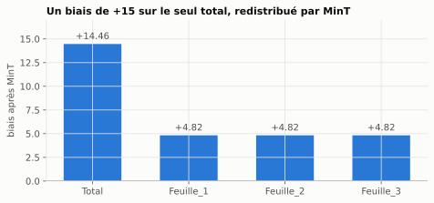
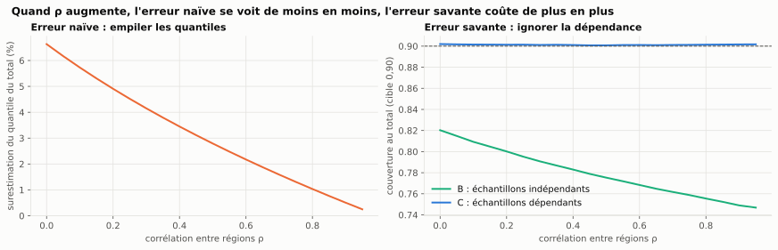
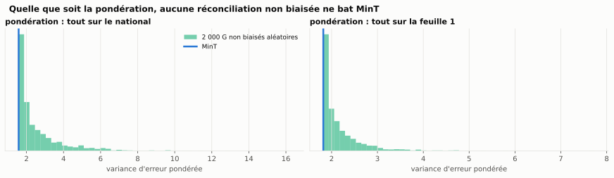

# Bloc 4 — Fondamentaux : ce que MinT garantit, et ce qu'il ne garantit pas

> Objectif : comprendre **pourquoi** MinT marche, et surtout **où il casse**. Il y a trois endroits : le biais, les
> quantiles et le mur numérique. Le bloc se termine par la question d'entretien senior : « MASE dégradé au SKU,
> amélioré au national ».

## Lancer

```bash
uv sync                  # une fois
uv run w37 biais         # où ça casse n°1 : MinT propage le biais           (< 1 s)
uv run w37 quantiles     # où ça casse n°2 : MinT ne réconcilie pas des quantiles  (≈ 5 s)
uv run jupyter lab 04_fondamentaux/notebooks
```

Pas à pas complet : **[TUTORIEL.md](TUTORIEL.md)**.

## Comment lire ce bloc

Les notebooks et ce README utilisent le même code d'encadrés :

| Encadré | Rôle |
|---|---|
| 💡 **Intuition** | l'idée, sans les équations |
| 🧪 **Exemple** | une expérience chiffrée, reproductible (graines fixes) |
| ⚠️ **Point d'attention** | le piège à éviter |
| 📌 **À retenir** | le mémo à garder |

## Les notebooks

| # | Notebook | Contenu | Figures |
|---|---|---|---|
| 01 | [`01_cadre_et_biais`](notebooks/01_cadre_et_biais.ipynb) | le cadre `ỹ = SGŷ`, les deux conditions, MinT comme projection ; **le biais** : contre-exemple, colonne de `P`, seuil | `biais_redistribution`, `biais_seuil` |
| 02 | [`02_quantiles_et_calibration`](notebooks/02_quantiles_et_calibration.ipynb) | quantile d'une somme, méthodes A / B / C, balayage en ρ, **bootstrap joint** | `quantile_somme`, `couverture_ABC`, `rho_balayage`, `bootstrap_joint` |
| 03 | [`03_diagnostic_et_entretien`](notebooks/03_diagnostic_et_entretien.ipynb) | le mur `m > T`, les trois hypothèses démontrées, Gauss-Markov et pondération par niveau, **la réponse rédigée** | `gauss_markov` |

---

## 1. Le cadre en une page

Les séries feuilles `b_t` déterminent tout : `y_t = S b_t`. Les prévisions de base `ŷ`, produites série par série,
sont **incohérentes**. On les réconcilie par `ỹ = S G ŷ`.

| Condition | Formule | Sens |
|---|---|---|
| (i) préservation du non-biais | `S G S = S` | un vecteur déjà cohérent n'est pas modifié |
| (ii) variance réconciliée | `Var(y − ỹ) = S G W G′ S′` | ce que MinT minimise (en trace) sous (i) |
| solution MinT | `G = (S′W⁻¹S)⁻¹ S′W⁻¹` | `P = SG` est une **projection oblique** (`P² = P`) |

💡 **Intuition.** Les vecteurs cohérents forment un sous-espace de dimension `nb` dans `ℝ^m`. Réconcilier, c'est
**projeter** sur ce sous-espace. MinT incline la projection selon `W⁻¹` : il bouge peu les séries bien prévues et
beaucoup les autres. OLS est le cas `W = I`, bottom-up le cas `G = [0 | I]`.

> 📌 **À retenir — le contrat de MinT.**
> 1. `SGS = S` ⟺ l'absence de biais est **préservée**.
> 2. Sous cette contrainte, MinT donne la plus petite variance d'erreur réconciliée, **à tous les niveaux à la
>    fois** (Gauss-Markov, notebook 03 § 5).
> 3. Le mot important est *préservée* : MinT ne **crée** pas l'absence de biais.

---

## 2. Où ça casse n°1 : MinT propage le biais

🧪 **Le contre-exemple du plan** (`uv run w37 biais`) : vérité exacte partout, sauf un biais de +15 sur le total.
`W = diag(1, 9, 9, 9)` : on fait 9 fois plus confiance au total qu'à chaque feuille.

```
           vérité  base  bottom-up    MinT  erreur bottom-up  erreur MinT
Total        60.0  75.0       60.0  74.464               0.0       14.464
Feuille_1    10.0  10.0       10.0  14.821               0.0        4.821
Feuille_2    20.0  20.0       20.0  24.821               0.0        4.821
Feuille_3    30.0  30.0       30.0  34.821               0.0        4.821
```

Le bottom-up ignore le total et ne voit rien. MinT, qui fait confiance au total, garde 14,46 du biais au total et
**en injecte 4,82 dans chaque feuille**. La raison est que la réconciliation est linéaire : le biais réconcilié vaut
`P @ biais_base`, autrement dit la colonne « total » de `P`.



🧪 **Le seuil** (Monte-Carlo, 20 000 tirages ; total précis σ = 1, feuilles σ = 3, `W` exacte) :

| biais du total | MAE total MinT | MAE total BU | MAE feuilles MinT | MAE feuilles BU |
|---|---|---|---|---|
| 0 | **0,79** | 4,13 | **1,97** | 2,39 |
| 4 | **3,86** | 4,13 | **2,23** | 2,39 |
| 6 | 5,79 | **4,13** | 2,54 | **2,39** |
| 8 | 7,71 | **4,13** | 2,95 | **2,39** |


MinT devient pire que le bottom-up à partir d'un biais d'environ **4,5 au total** et d'environ **5,25 aux
feuilles**. Ce n'est pas tout ou rien : c'est un **seuil**, et sa position dépend de la confiance que `W` accorde
à la série biaisée.

> ⚠️ **Point d'attention — « amélioré au national, dégradé au SKU » dépend de la baseline.** Comparé aux
> prévisions de base, c'est vrai. Comparé au bottom-up, un MinT biaisé finit par perdre **partout**. Dans un
> rapport, nommez toujours la baseline.

> ⚠️ **Point d'attention — où débiaiser.** Corrigez la **prévision de base** avant la réconciliation. Ne corrigez
> jamais la prévision réconciliée après coup : retoucher une seule série casse la cohérence.

> 📌 **À retenir — le biais.**
> - MinT **préserve** l'absence de biais, il ne la **crée** pas. Un biais se répand selon une colonne de `P`.
> - Plus `W` fait confiance à la série biaisée, plus la contamination est forte.
> - Le réflexe : **tester la moyenne des résidus par niveau, puis débiaiser avant de réconcilier.**
> - Argument commercial : la réconciliation vend la **cohérence**, pas la précision.

---

## 3. Où ça casse n°2 : MinT réconcilie des moyennes, pas des quantiles

C'est le cœur du bloc, et le point laissé ouvert par la W36.

🧪 **Le terrain d'expérience.** Un total et trois régions gaussiennes, corrélées à ρ = 0,6 (la météo les fait bouger
ensemble). Chaque modèle de base est **parfait sur sa marginale**. Les moyennes sont déjà cohérentes : la
réconciliation des moyennes ne fait rien, et tout ce qu'on observe est un pur effet « quantile ».


**(a) Aucun vecteur de quantiles n'est cohérent.** La somme des quantiles 90 % des régions couvre le total 93,1 %
du temps, et non 90 %. La cohérence est une propriété de la **loi jointe**, pas des marginales.

**(b) et (c) Trois façons de faire** (`uv run w37 quantiles`, graine 37, 400 000 tirages, cible 0,900) :

| série | quantile exact | **A** : `P @ quantiles` | couv. A | **B** : échantillons indépendants | couv. B | **C** : échantillons dépendants | couv. C |
|---|---|---|---|---|---|---|---|
| Total | 230,86 | 234,27 | 0,922 | 217,38 | **0,764** | 230,96 | **0,900** |
| Région 1 | 115,38 | 114,53 | 0,887 | 113,98 | 0,878 | 115,41 | 0,900 |
| Région 2 | 71,53 | 71,06 | 0,890 | 70,96 | 0,888 | 71,52 | 0,899 |
| Région 3 | 48,97 | 48,68 | 0,893 | 48,70 | 0,894 | 48,99 | 0,901 |


Lecture :

1. **A est fausse dans les deux sens à la fois.** Elle sur-couvre au total (0,922) et sous-couvre ailleurs (≈ 0,89).
   Aucun facteur global ne peut la corriger. Le vecteur obtenu somme parfaitement, mais il n'est le quantile de rien.
2. **B, celle qui a l'air correcte, est la pire : 0,764 au total pour 0,900 visé.** Projeter des échantillons est la
   bonne mécanique, mais des tirages indépendants perdent la dépendance, et la variance de la somme est massivement
   sous-estimée.
3. **C atteint 0,900 à tous les niveaux.** Sa seule différence avec B est la structure de dépendance.

🧪 **Le balayage en ρ** qui rend le résultat non discutable :

| ρ | somme des q90 | q90 de la somme | écart | couverture B (total) | couverture C (total) |
|---|---|---|---|---|---|
| 0,0 | 235,88 | 221,21 | **+6,6 %** | 0,816 | 0,901 |
| 0,3 | 235,88 | 226,48 | +4,2 % | 0,787 | 0,901 |
| 0,6 | 235,88 | 230,86 | +2,2 % | 0,764 | 0,900 |
| 0,9 | 235,88 | 234,70 | +0,5 % | **0,746** | 0,900 |



💡 **Le fait contre-intuitif.** Les deux erreurs vont **en sens opposé**. Plus les séries sont corrélées, moins
l'erreur naïve (A) se voit, et plus l'erreur savante (B) coûte cher. C'est exactement le régime de l'énergie et du
retail promotionnel.

🧪 **En pratique : le bootstrap joint** des résidus in-sample (T = 200). On rééchantillonne des **instants**, et
toutes les séries sont tirées ensemble :

| série | couverture bootstrap **joint** | couverture bootstrap **indépendant** |
|---|---|---|
| Total | **0,902** | 0,760 |
| Région 1 | 0,899 | 0,874 |
| Région 2 | 0,910 | 0,885 |
| Région 3 | 0,907 | 0,893 |


Le bootstrap indépendant reproduit l'erreur de B (0,760). Le bootstrap joint reproduit C sans connaître la vraie
covariance. Dans `hierarchicalforecast`, ce sont les méthodes `Bootstrap` et `PERMBU`.

> ⚠️ **Point d'attention — même avec des régions indépendantes, B échoue** (0,816 à ρ = 0). L'erreur du total est
> structurellement liée à celles des régions, puisque le total en est la somme. Un pipeline par série perd
> toujours ce lien.

> ⚠️ **Point d'attention — vérifier ce qu'on rééchantillonne.** Un bootstrap qui tire chaque série
> indépendamment, ou des résidus pris à des dates différentes selon les séries (historiques de longueurs
> différentes, trous), est une méthode B déguisée. **Même instant, toutes les séries** : c'est la seule règle.

> ⚠️ **Petite correction du plan.** Le tableau de balayage du plan indique une couverture de B de 0,766 pour
> ρ = 0,6. Son propre script donne **0,764**, la valeur de son tableau principal.

> 📌 **À retenir — le probabiliste.**
> - Ne **jamais** appliquer `P` à des quantiles (méthode A) : le résultat est cohérent, et faux dans les deux sens.
> - Réconcilier une distribution = **projeter des échantillons joints**, puis lire les quantiles (méthode C).
> - Des échantillons indépendants (méthode B) sous-estiment le risque agrégé : 0,764 au lieu de 0,900.
> - En pratique : **bootstrap joint des résidus in-sample**, mêmes instants pour toutes les séries.
> - Si la décision porte sur un niveau de service, MinT ponctuel n'en dit rien.

---

## 4. Où ça casse n°3 : le mur numérique

`W₁ = E′E/T` est de rang au plus `T`. Avec plus de séries que d'observations (`m > T`), elle est singulière, et il
faut `mint_shrink` (démonstration complète au bloc 2, notebook 02).

🧪 Bruit blanc, T = 156 (3 ans d'hebdomadaire) :

| séries m | rang de W₁ | W₁ inversible ? | λ shrinkage | cond(W shrink) |
|---|---|---|---|---|
| 50 | 50 | oui | 1,000 | 1,6 |
| 500 | 156 | **non** | 1,000 | 2,3 |
| 5 000 | 156 | **non** | 1,000 | 2,3 |

> ⚠️ **Point d'attention — le mur existe aussi en mémoire.** La formule directe de `Var(r_ij)` construit un tenseur
> `T × m × m` : 31 Go pour m = 5 000. La première version de `schafer_strimmer_lambda` faisait exactement cela, et
> le noyau du notebook 03 a été tué par l'OOM killer. λ ne dépend que de **sommes hors diagonale**, qui se
> calculent avec la matrice de Gram `T × T` et des sommes par ligne : la mémoire passe de O(T·m²) à O(T² + T·m),
> et le pic tombe à 0,6 Go pour m = 5 000. Le détail est dans la docstring de `mint/shrinkage.py`, et un test
> vérifie l'égalité avec la formule tensorielle. À 40 000 SKU, c'est `W` elle-même (12,8 Go en dense) qu'il ne faut
> plus former : `W = λD + (1 − λ)E′E/T` est une **diagonale plus une matrice de rang T**, que l'identité de Woodbury
> permet d'inverser sans jamais construire de matrice m × m.

> 📌 **À retenir — corollaire de mission.** Avant de chiffrer, demander **le nombre de séries et la profondeur
> d'historique**, dans cet ordre. Avec 40 000 SKU et 3 ans d'hebdomadaire, m/T ≈ 250 : le shrinkage n'est pas une
> option, et la mémoire non plus.

---

## 5. La question d'entretien senior

> **« Vous réconciliez avec MinT et votre MASE se dégrade au niveau SKU alors qu'il s'améliore au niveau national.
> Que se passe-t-il, et que faites-vous ? »**

Trois hypothèses, **dans cet ordre** (de la plus fréquente et la moins chère à vérifier à la plus subtile). Chacune
est démontrée dans le notebook 03 :

| # | Hypothèse | Test | Ce que montre le notebook 03 |
|---|---|---|---|
| 1 | une prévision de base est **biaisée** | `t` de la moyenne des résidus par série (`residual_bias_table`) | total biaisé de +1,5 : t = +9,0, feuilles \|t\| < 1,3 |
| 2 | `W` est **mal estimée** | backtest `ols` / `wls_struct` / `mint_shrink` par niveau, stabilité de λ | sans aucun biais, une `W` qui croit le total 3 fois plus précis qu'il ne l'est : MAE total 2,07 → 2,31, feuilles 2,07 → 2,10 |
| 3 | **fuite** ou fenêtre inadaptée | fenêtre de `W` strictement antérieure, journal du référentiel, `W` sur deux sous-fenêtres | — (checklist) |

**La réponse senior : quel niveau porte la décision ?** Si l'appro se décide au SKU, une amélioration au national
payée au SKU est une régression.



💡 **Le point avancé.** Avec la vraie `W` et sans biais, MinT minimise la variance d'erreur de **chaque série
simultanément** (Gauss-Markov, ordre de Loewner). Sur 2 000 réconciliations non biaisées tirées au hasard, aucune
ne bat MinT, quelle que soit la pondération des niveaux. La pondération `level_weights` ne sert donc qu'**à
arbitrer quand les hypothèses tombent** :

🧪 Avec un biais croissant sur le total, trois régimes apparaissent :

| biais du total | gagnant au total | gagnant aux feuilles | la pondération compte ? |
|---|---|---|---|
| 0 → 4 | MinT | MinT | non |
| **4,5 → 5** | **bottom-up** | **MinT** | **oui** |
| 5,5 → 8 | bottom-up | bottom-up | non |

> ⚠️ **Point d'attention — pondérer des MAE bruts.** Les MAE du total (≈ 4) et des feuilles (≈ 2,4) ne sont pas à
> la même échelle. Le score `0,1 × MAE total + 0,9 × MAE feuilles` reste dominé par le total : il choisit le
> bottom-up même quand la décision se prend à la feuille. Pondérez des erreurs **mises à l'échelle** (MASE, ou MAE
> relatif à la base), jamais des MAE bruts entre niveaux.

> 📌 **À retenir — pondérer les niveaux.**
> - Sans biais et avec la vraie `W`, MinT est optimal **pour tous les niveaux à la fois** : les poids n'y changent
>   rien.
> - Les poids servent à **arbitrer quand les hypothèses tombent** : biais, `W` estimée, cohérence souple
>   (λᵢ de 2606.23009).
> - Dans le contrat du bloc 3, `level_weights` sert donc à **choisir entre méthodes** en backtest. Il ne modifie pas
>   la formule de MinT.

La réponse complète, rédigée pour être dite en entretien, est en fin du
[notebook 03](notebooks/03_diagnostic_et_entretien.ipynb) (§ 6).

---

## Le code

| Brique | Fichier |
|---|---|
| Hiérarchie jouet, contre-exemple, allocation du biais, Monte-Carlo | `src/w37_reconciliation/fundamentals/bias.py` |
| Hiérarchie gaussienne, méthodes A / B / C, balayage en ρ, bootstrap | `src/w37_reconciliation/fundamentals/probabilistic.py` |
| Test de biais des résidus, Gauss-Markov pondéré | `src/w37_reconciliation/fundamentals/diagnostics.py` |
| λ sans tenseur `T × m × m` | `src/w37_reconciliation/mint/shrinkage.py` |
| Tests | `tests/unit/test_fundamentals.py`, `tests/unit/test_shrinkage.py` |

## Ce que le bloc 4 corrige ou précise par rapport au plan

1. **Le seuil de biais.** Le plan dit « MASE dégradé au niveau feuille, amélioré au niveau agrégé ». C'est vrai
   face aux prévisions de base. Face au bottom-up, il existe un seuil de biais (≈ 4,5 ici) au-delà duquel MinT
   perd **partout**.
2. **La couverture de B à ρ = 0,6** vaut 0,764, et non 0,766.
3. **Gauss-Markov.** Pondérer les niveaux ne change rien à l'optimum de MinT tant que `W` est juste et qu'il n'y a
   pas de biais. `level_weights` est un critère de choix de méthode, pas un paramètre de la formule.
4. **Le mur m > T est aussi un mur mémoire**, et l'implémentation naïve du λ de Schäfer–Strimmer le heurte dès
   quelques milliers de séries.
