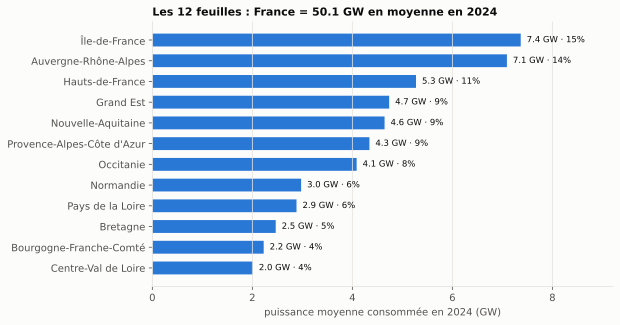
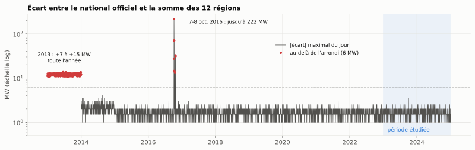
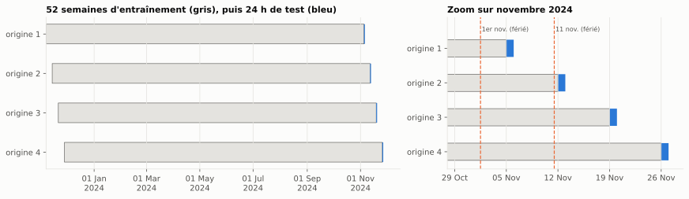
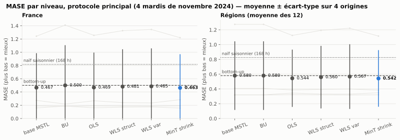
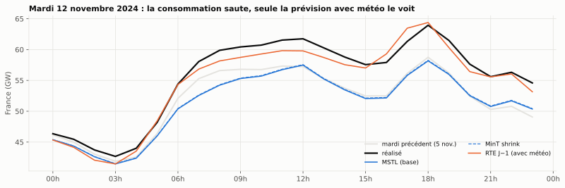
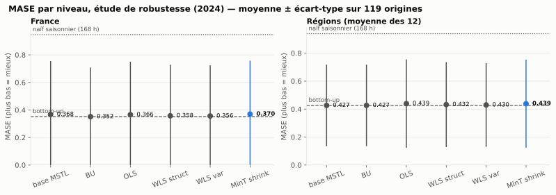
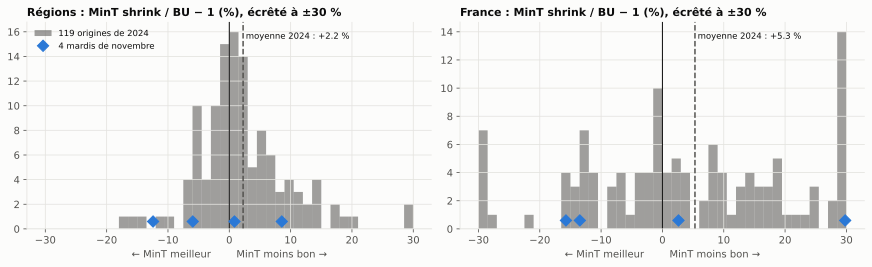
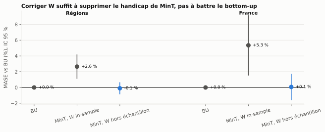

# Bloc 5 — Mini-projet éCO2mix : réconcilier les prévisions de consommation des régions et de la France

> **Objectif métier.** Supprimer les arbitrages manuels du comité de pilotage en livrant un jeu unique de
> prévisions de consommation électrique dont **la somme des régions reproduit exactement le total France**,
> sans retouche.

**Réponse courte.** L'objectif est atteint : toute méthode réconciliée livre des prévisions qui somment
exactement, et c'est vérifié par assertion à chaque origine. Sur cette hiérarchie, la meilleure méthode est le
**bottom-up**. MinT shrink, la méthode de référence, fait **moins bien** sur l'année 2024. La cause est
identifiée et démontrée par une expérience contrôlée : sa matrice W est estimée sur des résidus in-sample qui ne
ressemblent pas aux vraies erreurs de prévision.

## Lancer

```bash
uv sync
make eco2mix                      # télécharge (1re fois, ≈ 5 min), prépare, backtest 4 origines, rapport
make eco2mix-robustness           # étude de robustesse : 119 origines de 2024 (≈ 40 min)
uv run jupyter lab 05_mini_projet_eco2mix
```

Pas à pas complet : **[TUTORIEL.md](TUTORIEL.md)**. La *Definition of Done* du plan tient dans un notebook qui
tourne de bout en bout sans intervention : **[`reconciliation_eco2mix.ipynb`](reconciliation_eco2mix.ipynb)**.

## Comment lire ce bloc

| Notebook | Ce qu'on y apprend |
|---|---|
| [`01_donnees_et_hierarchie`](notebooks/01_donnees_et_hierarchie.ipynb) | provenance, défaut de changement d'heure de la source, 🔬 test d'additivité, saisonnalités, corrélation des régions |
| [`02_modeles_de_base_et_hypotheses`](notebooks/02_modeles_de_base_et_hypotheses.ipynb) | SeasonalNaive et MSTL ; 🔬 biais, bruit blanc, structure de W ; l'hypothèse cachée de `mint_shrink` |
| [`03_reconciliation_protocole_principal`](notebooks/03_reconciliation_protocole_principal.ipynb) | le protocole, ce que fait chaque méthode, le tableau de la Definition of Done, le cas du 12 novembre |
| [`04_robustesse_et_tests`](notebooks/04_robustesse_et_tests.ipynb) | 119 origines, 🔬 tests appariés avec correction de Holm, 🧪 expérience contrôlée sur W, conclusion |
| [`reconciliation_eco2mix`](reconciliation_eco2mix.ipynb) | la Definition of Done, exécutable de bout en bout |

Les notebooks suivent le code d'encadrés du dépôt : 💡 intuition · 🧪 exemple · ⚠️ point d'attention ·
📌 à retenir, plus **🔬 test d'hypothèse** (hypothèse formulée, testée, puis acceptée ou rejetée).

---

## 1. Les données

**Source** : [éCO2mix régional, données consolidées et définitives](https://odre.opendatasoft.com/explore/dataset/eco2mix-regional-cons-def/information/)
et [éCO2mix national](https://odre.opendatasoft.com/explore/dataset/eco2mix-national-cons-def/information/),
**Open Data Réseaux Énergies (ODRÉ) — RTE, Licence Ouverte v2.0**. Elles sont téléchargées par l'API
(`w37 eco2mix download`), et chaque fichier brut est tracé dans un manifeste (URL, date, taille, sha256).

**Hiérarchie** : 12 régions métropolitaines → France. Le total est construit comme la somme des régions.



### Trois découvertes faites en vérifiant les données

| Découverte | Conséquence | Traitement |
|---|---|---|
| **La Nouvelle-Aquitaine s'arrête au 31/12/2024** ; les 11 autres régions vont jusqu'au 30/06/2026 | depuis 2025, la somme des régions n'est plus le total France | protocole limité aux **données définitives 2013 → 2024** |
| **Défaut de changement d'heure** : la source range 48 demi-heures par jour local. Chaque année et dans chaque région : **2 doublons** fin mars, **1 heure manquante** fin octobre | MSTL refuse les trous ; une ligne absente fausse le total sans aucune erreur | doublons fusionnés, heure interpolée et marquée (144 heures sur 12 ans × 12 régions) ; tout trou de plus d'une heure lève une erreur |
| **Le total officiel n'est pas toujours la somme des régions** : +7 à +15 MW toute l'année 2013, jusqu'à 222 MW les 7-8 octobre 2016 | réconcilier vers un total incohérent n'aurait pas de sens | 🔬 test année par année : écart ≤ 6 MW (l'arrondi) de 2014 à 2024 hors 2016, donc **sur toute la période étudiée** |




## 2. Le protocole, fixé avant les résultats

Tout est dans [`configs/eco2mix.yaml`](../configs/eco2mix.yaml) :

| Élément | Choix | Pourquoi |
|---|---|---|
| Pas de temps | 1 h, **moyenne** des deux demi-heures, en UTC | des MW restent des MW ; pas de jour de 23 ou 25 h |
| Modèles de base | **SeasonalNaive(168)** (baseline n°1) et **MSTL([24, 168])** (réconcilié) | double saisonnalité jour / semaine |
| Fenêtre d'entraînement | 52 semaines glissantes, **strictement antérieures** à l'origine | ni fuite, ni W estimée sur le test |
| Horizon | h = 24 h, prévision du jour J à J 00:00 UTC | |
| Réconciliations | BU, OLS, WLS struct, WLS var, MinT shrink (HierarchicalForecast 1.5.1) | de W = rien à W pleine |
| Métrique | **MASE par niveau** (France ; moyenne des 12 régions), échelle = naïf saisonnier sur le train | jamais une moyenne globale |
| Protocole principal | **4 mardis de novembre 2024** (Definition of Done) | |
| Étude de robustesse | **119 origines**, une tous les 3 jours de janvier à décembre 2024 | tous les jours de la semaine, toutes les saisons |



## 3. Les hypothèses de MinT, testées

| | Hypothèse | Test | Résultat |
|---|---|---|---|
| 🔬 | Le total France = Σ régions | écart national − somme, année par année | **acceptée** sur 2014-2024 hors 2016 (≤ 6 MW) |
| 🔬 H1 | Prévisions de base sans biais | t HAC + Holm, sur les **erreurs hors échantillon** (119 origines) | **acceptée** : aucun biais significatif |
| 🔬 H2 | Résidus in-sample = bruit blanc | Ljung-Box (24 h, 168 h) | **rejetée** partout ; autocorrélation négative à 3-6 h et 48 h : signature d'un **lissage bilatéral** |
| 🔬 H3 | W in-sample ∝ covariance des vraies erreurs | corrélation moyenne entre régions, IC bootstrap sur les origines | **rejetée** : 0,11 in-sample contre **0,56 [0,45 ; 0,65]** hors échantillon |

⚠️ **Le test de biais sur résidus in-sample ne prouve rien avec MSTL** : ses résidus sont les *restes* d'une
décomposition, centrés par construction (notebook 02, § 4). Le test utile est hors échantillon.


## 4. Résultats

### Protocole principal (Definition of Done) : 4 mardis de novembre 2024

Sortie de `uv run w37 eco2mix report` :

```
MASE par niveau (main, 4 origines) : moyenne et écart-type

             France mean  France std  Régions mean  Régions std
SN                 0.817       0.329         0.825        0.152
base               0.467       0.520         0.580        0.464
BU                 0.500       0.607         0.580        0.464
OLS                0.469       0.527         0.544        0.388
WLS struct         0.481       0.564         0.560        0.423
WLS var            0.485       0.573         0.567        0.438
MinT shrink        0.463       0.507         0.542        0.383

Incohérence max (MW) après réconciliation : 0.00e+00   [OK] < 1e-06
Incohérence max (MW) des prévisions de base MSTL : 671.9
MinT shrink vs BU, Régions : -2.25% ± 9.01% (meilleur à 2/4 origines)
MinT shrink vs BU, France  : +0.81% ± 20.99% (meilleur à 2/4 origines)
```



Une origine domine tout : le **12 novembre 2024**, où la consommation saute de 3,7 GW par rapport au mardi
précédent. Un contrefactuel montre que le lundi férié qui termine la fenêtre d'entraînement n'en explique que
10 %. La prévision J−1 de RTE, qui utilise la météo, fait 3 à 4 fois moins d'erreur ce jour-là : un choc
météorologique est l'explication la plus plausible, **non vérifiée** faute de températures dans le jeu.



**Chiffre clé du protocole principal** : MinT shrink fait varier le MASE régional de **−2,2 %** par rapport au
bottom-up, mais n'est meilleur qu'à 2 origines sur 4, et l'écart n'est **pas significatif** (p = 0,43, IC de la
différence très large).

### Étude de robustesse : 119 origines de 2024

```
MASE par niveau (robustness, 119 origines) : moyenne et écart-type

             France mean  France std  Régions mean  Régions std
SN                 0.947       0.996         0.939        0.812
base               0.368       0.387         0.427        0.291
BU                 0.352       0.356         0.427        0.291
OLS                0.366       0.385         0.439        0.316
WLS struct         0.358       0.371         0.432        0.304
WLS var            0.356       0.368         0.430        0.299
MinT shrink        0.370       0.388         0.439        0.315

MinT shrink vs BU, Régions : +2.25% ± 7.70% (meilleur à 48/119 origines)
MinT shrink vs BU, France  : +5.31% ± 20.12% (meilleur à 53/119 origines)
```



- **Le bottom-up est la meilleure réconciliation**, aux deux niveaux. Au niveau France, sommer les 12 prévisions
  régionales fait mieux que la prévision MSTL directe du total.
- **MinT shrink fait moins bien que le bottom-up sur les 13 séries**, sans exception. Après correction de Holm
  sur 8 comparaisons, l'écart reste significatif au test t (p ≈ 0,05), à la limite pour Wilcoxon et HAC : la
  preuve est **modérée**, le signe est constant.
- Les 4 mardis de novembre étaient tombés du côté favorable d'une distribution très étalée.



### L'expérience qui identifie la cause

On garde tout identique, sauf W : au lieu des résidus in-sample, on l'estime sur les **erreurs hors échantillon
des origines passées**, strictement antérieures, donc sans fuite (`reconcile_with_past_errors`, testé).

| 99 origines | MASE régional vs BU | p (Wilcoxon) |
|---|---|---|
| MinT shrink (W in-sample) | **+2,6 %** | 0,017 |
| MinT, W hors échantillon | **−0,1 %** | 0,83 |



Corriger W **supprime le handicap** de MinT, mais ne lui permet pas de battre le bottom-up. Plausiblement, les
erreurs régionales sont fortement corrélées et de même signe : il n'y a pas d'information croisée à exploiter.

## 5. Le chiffre clé

> **Sur 119 origines de 2024, MinT shrink augmente le MASE régional de 2,3 % par rapport au bottom-up**
> (+5,3 % au niveau France), et fait moins bien sur les 13 séries. Sur les 4 origines du protocole principal,
> il le baissait de 2,2 %, sans significativité. La cause est une hypothèse cachée de `mint_shrink` : W est
> estimée sur des résidus in-sample qui ne ressemblent pas aux erreurs de prévision.

## 6. Recommandation

1. **Livrer le bottom-up.** Il remplit l'objectif (cohérence exacte), il est le plus précis ici, et il est
   le plus facile à défendre : « le national est la somme des régions ».
2. **Ne pas utiliser `mint_shrink` avec les résidus in-sample de MSTL** (ni d'un modèle à lissage bilatéral).
   Si MinT est nécessaire, estimer W sur des **erreurs de backtest glissant**.
3. **Investir dans les modèles de base** (température, jours fériés) plutôt que dans la réconciliation : les
   plus grosses erreurs sont communes à toutes les régions, et aucune réconciliation ne les rattrape.

## Ce que ce bloc corrige ou précise par rapport au plan

1. **Le jeu ne va pas jusqu'en janvier 2026 pour toutes les régions** : la Nouvelle-Aquitaine s'arrête fin 2024.
2. **« Vérifier qu'aucune région n'a de trou »** : il y en a dans toutes les régions, chaque année (défaut de
   changement d'heure). Et une ligne absente est plus dangereuse qu'un NaN : elle ne lève aucune erreur.
3. **4 origines ne permettent pas de classer les méthodes** : le classement s'inverse sur 119 origines.
4. **Le test de biais sur résidus in-sample est sans valeur avec MSTL** ; le faire hors échantillon.
5. **La règle de Newey-West (1994) sous-dimensionne le HAC** sur des séries très persistantes (taille réelle
   27 % au lieu de 5 % en simulation) : on utilise ⌈1,3 √n⌉ retards (Lazarus, Lewis, Stock et Watson, 2018).

## Limites

| Limite | Piste |
|---|---|
| Ni météo ni calendrier dans les modèles de base | ajouter température et jours fériés |
| Hiérarchie plate (1 total, 12 feuilles) | hiérarchie plus profonde (régions × secteurs) |
| Une année d'évaluation, h = 24 h | refaire sur 2023 et à d'autres horizons |
| Prévisions ponctuelles | réconciliation probabiliste (bloc 6, BayesReconPy) |
| La prévision J−1 de RTE n'est qu'un repère : elle est faite la veille, avec la météo | comparaison à information égale |

## Le code

| Brique | Fichier |
|---|---|
| Téléchargement, manifeste, sha256 | `src/w37_reconciliation/eco2mix/source.py` |
| Contrôles qualité, changement d'heure, 30 min → 1 h, hiérarchie | `src/w37_reconciliation/eco2mix/prepare.py` |
| Backtest à origines glissantes, réconciliation, expérience sur W | `src/w37_reconciliation/eco2mix/backtest.py` |
| MASE par niveau, incohérence, chiffre clé | `src/w37_reconciliation/eco2mix/metrics.py` |
| Tests d'hypothèses (HAC, Ljung-Box, Holm, tests appariés, Diebold-Mariano) | `src/w37_reconciliation/eco2mix/inference.py` |
| Orchestration des étapes et des fichiers | `src/w37_reconciliation/eco2mix/run.py` |
| Figure clé | `src/w37_reconciliation/eco2mix/figures.py` |
| Protocole | `configs/eco2mix.yaml` |
| Tests | `tests/unit/test_eco2mix.py` (données synthétiques, < 2 s), `tests/integration/test_eco2mix_backtest.py` |

Environnement de référence : Python 3.12, `hierarchicalforecast 1.5.1`, `statsforecast 2.1.1`,
`statsmodels 0.15.0`, verrouillés dans `uv.lock`. Données téléchargées le 02/10/2026 à 22 h UTC (dates exactes
dans `data/eco2mix/raw/manifest.json`).
