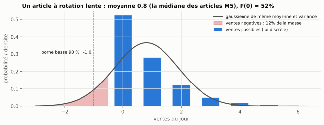
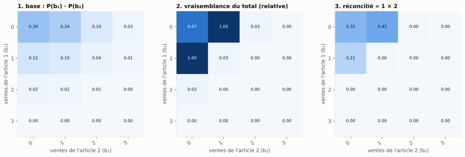
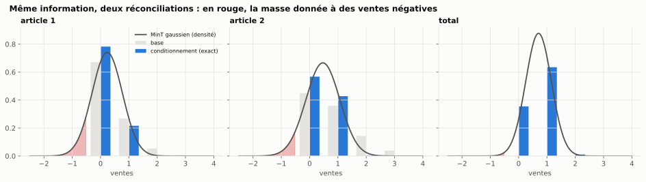
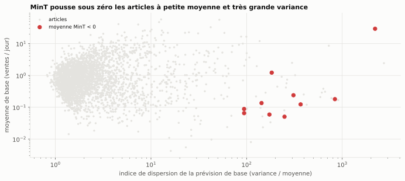
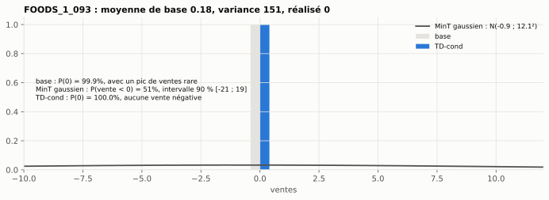

# Bloc 6 — Stack technique : BayesReconPy, réconcilier des ventes intermittentes sans valeurs négatives

> **La question du plan.** *Sur une hiérarchie de ventes intermittentes, combien de prévisions négatives MinT
> produit-il, et combien BayesReconPy en produit-il ?*

**Réponse.** Sur le magasin CA_1 de M5 (3 049 articles, 11 agrégats, prévision à 1 jour), le MinT gaussien
produit **11 moyennes négatives** (0,36 %, jusqu'à −18 ventes). Surtout, **98 % de ses intervalles à 90 %
commencent sous zéro**. BayesReconPy (MixCond, TD-cond) n'en produit **aucune**, par construction. Le contrat du
bloc 3 (`max_negative_share: 0.001`) **bloquerait** MinT. Et TD-cond est aussi la méthode **la plus précise** aux
deux niveaux.

## Lancer

```bash
uv sync                           # installe aussi le groupe « bayesrecon » (bayesreconpy 0.5.0, jax, PuLP < 4)
uv run w37 bayesrecon run         # télécharge l'exemple M5 (76 Mo, 1re fois), 4 méthodes, scores, gate (≈ 10 s)
uv run jupyter lab 06_bayesreconpy/notebooks
```

Pas à pas complet : **[TUTORIEL.md](TUTORIEL.md)**.

| Notebook | Ce qu'on y apprend |
|---|---|
| [`01_conditionnement_a_la_main`](notebooks/01_conditionnement_a_la_main.ipynb) | pourquoi une gaussienne déborde sous zéro ; le conditionnement sur une grille de 2 articles, calculé exactement ; l'algorithme BUIS en dix lignes ; BayesReconPy retrouve la solution exacte |
| [`02_m5_negatifs_et_precision`](notebooks/02_m5_negatifs_et_precision.ipynb) | la réponse chiffrée, le mécanisme des négatifs, la précision (MASE, MIS, RPS), 🔬 validation contre la vignette R officielle, 🔬 comparaison article par article |

---

## 1. Vérification du paquet : ce que dit le plan, et ce qu'on constate

Chaque point du plan a été vérifié le 03/10/2026 (PyPI, GitHub, Crossref, installation réelle).

| Critère | Le plan | Constaté | |
|---|---|---|---|
| Version | 0.5.0 du 10 mai 2026 | 0.5.0, publiée le 10/05/2026 sur PyPI | ✅ |
| Revue par les pairs | JOSS, vol. 10 n° 111, 30/07/2025 | confirmé (Biswas, Nespoli, Azzimonti, Zambon, Rubattu, Corani), DOI 10.21105/joss.08336 | ✅ |
| Python | ≥ 3.12 | `requires_python >= 3.12` | ✅ |
| **Licence** | **MIT, aucune friction** | **incohérente** : PyPI et `pyproject.toml` disent **MIT**, mais le fichier `LICENSE.md` du dépôt et GitHub disent **LGPL-3.0** | ⚠️ |
| **Installation** | `pip install` | **cassée telle quelle depuis le 25/09/2026** : la dépendance `PuLP>=2.9` n'est pas bornée, et PuLP 4.0.0 ne fournit plus `PULP_CBC_CMD`, que le paquet importe. Solution : `pulp<4` | ⚠️ |
| **Effet de bord** | — | `reconc_td_cond` **modifie en place** les pmf reçues (≈ 1e-9 ajouté, sans renormaliser) ; un appel suivant avec les mêmes objets peut échouer | ⚠️ |
| Contrainte d'usage | — | TD-cond exige une hiérarchie **équilibrée** : chaque article dans exactement un groupe du niveau le plus bas | ℹ️ |
| Communauté | « nettement plus petite que Nixtla » | 15 étoiles, 0 fork sur GitHub ; dernier commit le 22/05/2026 | ✅ |
| Dépendances | — | lourdes : jax, scikit-learn, PuLP, jnlr. On les isole dans un groupe uv dédié | ℹ️ |

⚠️ **Sur la licence.** En cas de contradiction, le fichier de licence du dépôt fait foi en pratique, et la
LGPL-3.0 impose des obligations si l'on **modifie et redistribue** le paquet (l'utiliser comme bibliothèque reste
simple). Avant une mission, **demander aux auteurs de lever l'ambiguïté**, et ne pas écrire « MIT » dans une
proposition commerciale.

## 2. Le principe : conditionner au lieu de projeter



MinT **projette** des moyennes et des covariances : il vit dans ℝ, et une loi symétrique de la bonne variance
déborde sous zéro dès que la moyenne est petite. BayesReconPy **conditionne** : il garde la loi jointe des
articles et la repondère par ce que disent les prévisions des agrégats (règle de Bayes). Le résultat reste sur
les entiers positifs.



Sur l'exemple jouet du notebook 01, calculable exactement, BayesReconPy retrouve la loi réconciliée exacte à
0,001 près (test `test_bayesreconpy_buis_recovers_the_exact_conditional_distribution`).



## 3. Résultats sur M5 CA_1

Sortie de `uv run w37 bayesrecon run` :

```
                                          base  MinT gaussien  bottom-up    MixCond   TD-cond
secondes                                0.0000         0.2145     0.3728     0.7450    5.7672
incohérence max (ventes)              241.7179         0.0000     2.8098     0.0000    0.0000
articles · moyennes < 0                 0.0000        11.0000     0.0000     0.0000    0.0000
articles · bornes basses < 0            0.0000      2992.0000     0.0000     0.0000    0.0000
articles · masse sous zéro (moyenne)    0.0000         0.1457     0.0000     0.0000    0.0000
articles · MASE                         1.0800         1.3520     1.0800     1.0887    1.0918
articles · MIS                          5.7504         7.9917     5.7504     5.8229    5.7465
articles · RPS                          0.6763         0.8188     0.6763     0.6741    0.6687
agrégats · MASE                         0.7785         0.9560     0.9396     0.8839    0.7913
agrégats · MIS                        452.0613      1824.9465  2329.8182  2311.9091  443.9091

Quality gate du bloc 3 (max_negative_share = 0.001, sur les moyennes des articles) :
  MinT gaussien  0.0036  [BLOQUÉ]      bottom-up, MixCond, TD-cond  0.0000  [OK]
```

(Lignes de parts et colonne « base » de la gate omises ; la base est incohérente et ne passerait pas la gate de
cohérence.)

**Pourquoi MinT passe sous zéro.** Avec une W diagonale, l'ajustement de chaque article est proportionnel à sa
variance (corrélation −0,98). Les articles passés sous zéro ont une petite moyenne et une **dispersion
énorme** (variance / moyenne : 183 en médiane, contre 1,9 pour les autres). Ce sont les prévisions « presque
toujours 0, parfois un gros pic ».





**La précision.** MinT gaussien est le moins précis sur les articles, pour les trois scores. MixCond et le
bottom-up rendent les intervalles des agrégats environ 5 fois moins bons : supposer 3 049 articles
indépendants donne un total beaucoup trop étroit. C'est la méthode B du bloc 4. **TD-cond** évite ce piège en
partant des agrégats : il est le meilleur en RPS et en MIS sur les articles, et le meilleur en MIS sur les
agrégats.

### 🔬 Validation contre la vignette R officielle

La vignette [`mixed_reconciliation`](https://cran.r-project.org/web/packages/bayesRecon/vignettes/mixed_reconciliation.html)
du paquet R `bayesRecon` traite le même magasin avec les mêmes prévisions de base. Nos skill scores (% vs base,
positif = mieux) la reproduisent :

| | | Gauss (ici / R) | MixCond (ici / R) | TD-cond (ici / R) |
|---|---|---|---|---|
| agrégats | MASE | −23,44 / −23,44 | −14,37 / −12,61 | −1,40 / +0,16 |
| | MIS | −66,19 / −66,19 | −73,42 / −73,49 | +1,43 / +1,64 |
| | RPS | −30,68 / −30,69 | −24,91 / −24,99 | −1,86 / −1,30 |
| articles | MASE | −89,58 / −89,48 | −0,67 / −0,22 | −0,34 / +0,11 |
| | MIS | −36,88 / −36,83 | +0,58 / +0,22 | +2,03 / +2,15 |
| | RPS | −48,62 / −55,62 | +2,00 / +2,02 | +3,72 / +3,90 |

Écart médian : 0,15 point. Les écarts de MixCond et TD-cond sont du bruit Monte-Carlo (R et Python n'ont pas le
même générateur aléatoire). Le seul écart notable, le RPS gaussien des articles, tient à la discrétisation d'une
loi normale sur les entiers. Nous utilisons Φ((k + 0,5 − μ)/σ).

### 🔬 Article par article

TD-cond a un meilleur RPS que MinT gaussien sur **66 %** des articles, et que la base sur **59 %**. MixCond ne se
distingue pas de la base (52 %, p = 0,28). Les p-valeurs de Wilcoxon sont **indicatives** : les articles partagent
le même jour, donc ne sont pas indépendants.

## 4. Ce que ce bloc corrige ou précise par rapport au plan

1. **La licence n'est pas « MIT sans ambiguïté »** : MIT dans les métadonnées, LGPL-3.0 dans le fichier de licence.
2. **Le paquet ne s'installe pas tel quel** depuis la sortie de PuLP 4 (25/09/2026). Il faut borner `pulp<4`.
3. **`reconc_td_cond` a un effet de bord** (modification en place des entrées). Il faut passer des copies.
4. **Le chiffre de négatifs dépend de ce qu'on compte.** 0,36 % des moyennes, mais 98 % des bornes basses. Pour
   une décision de niveau de service, c'est le second qui compte.
5. **MixCond n'est pas la méthode à retenir en grande dimension** (ESS ≈ 30 %, intervalles des agrégats
   dégradés) : c'est **TD-cond**.

## 5. Recommandation

> **BayesReconPy est un complément spécialisé, pas un socle** (le plan avait raison), et **TD-cond** est la
> méthode à utiliser quand les articles sont des comptages intermittents et que la décision porte sur un
> niveau de service.

| Situation | Choix |
|---|---|
| volumes continus, loin de zéro (énergie : bloc 5) | HierarchicalForecast, bottom-up ou MinT avec W estimée sur des erreurs de prévision |
| comptages intermittents, décision sur la moyenne | bottom-up, ou MinT **avec** un contrôle de non-négativité (quality gate) |
| comptages intermittents, décision sur un quantile | **BayesReconPy, TD-cond** |

**Conditions pour l'utiliser en mission** : licence clarifiée avec les auteurs, versions épinglées (`bayesreconpy==0.5.0`,
`pulp<4`), copies défensives des entrées, et un environnement Python ≥ 3.12.

## Limites

| Limite | Conséquence |
|---|---|
| Un seul jour de prévision, un seul magasin | la conclusion sur la **précision** est indicative ; celle sur les **négatifs** est structurelle |
| MinT sans covariance entre articles (pas de résidus) | c'est la même information que pour le conditionnement, mais pas le MinT « complet » |
| Prévisions de base fournies (ADAM) | on ne teste que la réconciliation, pas le modèle de base |

## Le code

| Brique | Fichier |
|---|---|
| Téléchargement avec manifeste (commun aux blocs 5 et 6) | `src/w37_reconciliation/download.py` |
| Données M5 CA_1, figées au commit du tag v0.5.0 | `src/w37_reconciliation/bayesrecon/example.py` |
| Pmf et lois normales sous une même interface | `src/w37_reconciliation/bayesrecon/pmf.py` |
| MinT gaussien, bottom-up, MixCond, TD-cond (copies défensives) | `src/w37_reconciliation/bayesrecon/methods.py` |
| Négatifs, MASE, MIS, RPS, skill scores | `src/w37_reconciliation/bayesrecon/scores.py` |
| L'exemple jouet exact et BUIS à la main | `src/w37_reconciliation/bayesrecon/toy.py` |
| Protocole | `configs/bayesrecon.yaml` |
| Tests | `tests/unit/test_bayesrecon.py` (13 tests, < 1 s, sans réseau) |

**Données** : prévisions de base ADAM du magasin CA_1 de M5 (Makridakis, Spiliotis et Assimakopoulos, 2022),
distribuées avec `bayesRecon` et BayesReconPy. Elles sont téléchargées au commit `79cd56f` (tag v0.5.0) et ne sont
**pas** redistribuées dans ce dépôt : le plan rappelle que les règles de M5 limitent la réutilisation.
